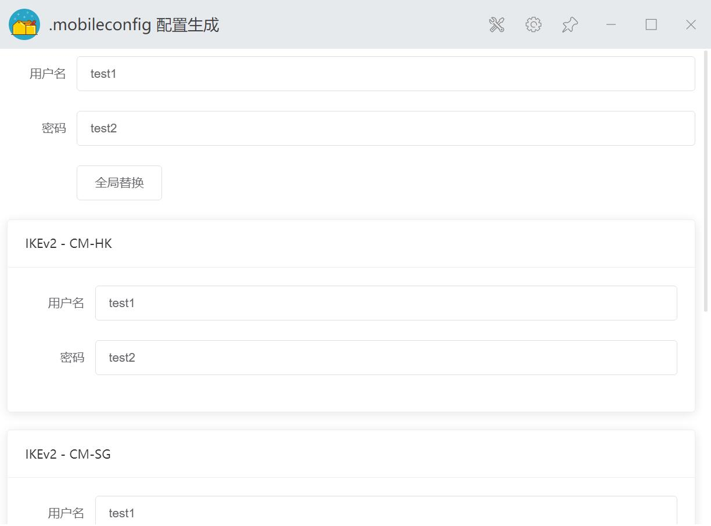

# uTools 运维配置小工具
目前仅支持替换 .mobileconfig 中的用户名密码

Github: [https://github.com/wangerzi/utools-effective-devops](https://github.com/wangerzi/utools-effective-devops)
Gitee : [https://gitee.com/wangerzi/utools-effective-devops](https://gitee.com/wangerzi/utools-effective-devops)

## 版本更新

### v1.0.0 支持 .mobileconfig 配置替换
初始版本，满足运维实际需要

## 内置功能

### .mobileconfig vpn 编辑器
复制 .mobileconfig 文件，然后触发 utools，修改后 `⌘ + C / Ctrl + C` 保存即可

